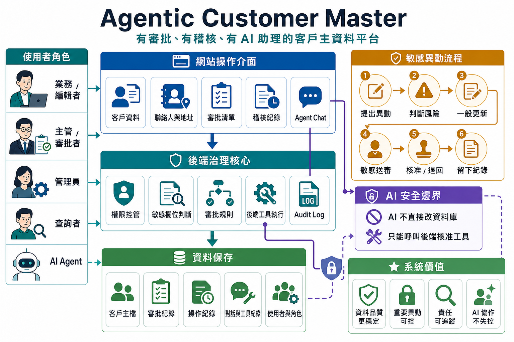
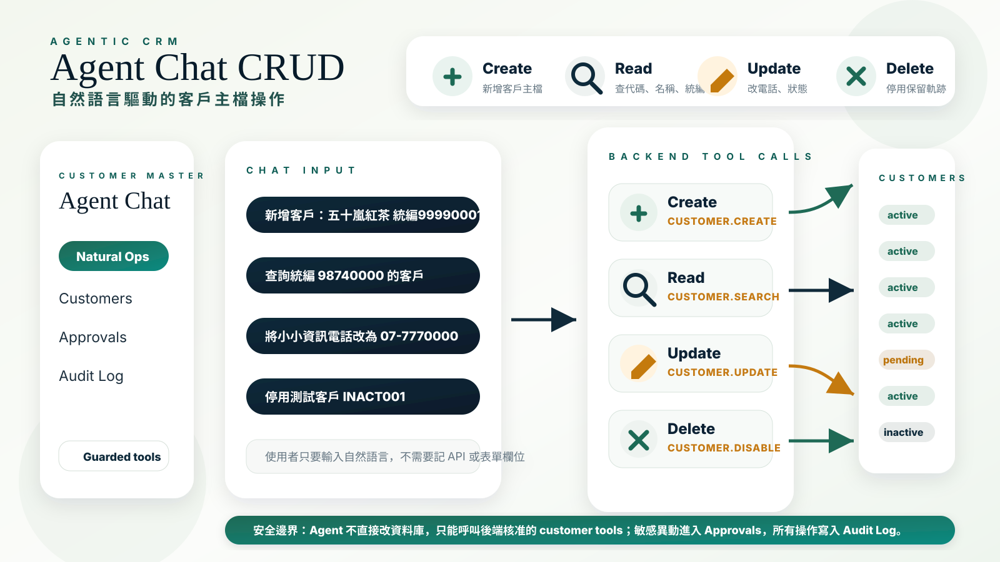

# Agentic Customer Master

Monorepo for a customer master maintenance system with:

- Traditional CRUD UI
- Approval workflow for sensitive changes
- Agent chat interface that only acts through backend tools



## Agent Chat CRUD



## Structure

```text
backend/   FastAPI + SQLAlchemy + Alembic + JWT + LangGraph
frontend/  Next.js + Tailwind
```

## Current Status

Implemented:

- Customer CRUD API
- Contacts and addresses API
- Approval workflow API
- Audit log writes on key mutations
- JWT demo authentication
- Audit log query API for admin
- User and role management MVP API for admin
- Rule-based agent with optional LangGraph + OpenAI intent classification
- Frontend customers, approvals, login, and agent chat core flows
- Dockerfiles and docker compose skeleton

Still not fully complete:

- Real production auth provider integration such as Firebase/Auth.js
- Full frontend audit log data wiring
- Full user management backend
- End-to-end tested production deployment

## Local Quick Start

1. Copy `.env.example` to `.env`.
2. Optionally copy `frontend/.env.example` to `frontend/.env.local`.
3. Start PostgreSQL.
4. Install backend dependencies.
5. Initialize schema and seed data.
6. Run backend.
7. Install frontend dependencies.
8. Run frontend.

## Backend Commands

From `backend/`:

```bash
pip install -r requirements.txt
python scripts/init_db.py
uvicorn app.main:app --reload
pytest
```

Notes:

- `python scripts/init_db.py` creates tables directly from SQLAlchemy models and seeds sample customer data.
- Alembic initial migration is included, but local MVP bootstrapping can use the init script directly.
- If `OPENAI_API_KEY` is configured, the agent layer will use LangGraph plus OpenAI Responses API for LLM-based intent normalization before executing backend-approved tools.
- If `OPENAI_API_KEY` is not configured, the agent falls back to the internal rule-based parser.

## Frontend Commands

From `frontend/`:

```bash
npm install
npm run dev
```

Recommended frontend env:

```env
NEXT_PUBLIC_API_BASE_URL=http://localhost:8000/api/v1
API_BASE_URL_SERVER=http://localhost:8000/api/v1
```

## Demo Auth

Backend supports JWT login at `/api/v1/auth/login`.

Default demo accounts:

- `admin@example.com / admin1234`
- `approver@example.com / approver1234`
- `editor@example.com / editor1234`
- `viewer@example.com / viewer1234`

Behavior:

- The frontend stores the bearer token in a cookie.
- Server-side frontend fetches read the same cookie and forward the token to backend APIs.
- For backward compatibility in tests and MVP bootstrapping, backend still accepts `X-User-*` headers as fallback.

## Docker Compose

This repo now includes:

- `backend/Dockerfile`
- `frontend/Dockerfile`
- root `docker-compose.yml`

Start the stack from the repo root:

```bash
docker compose up --build
```

Services:

- Frontend: `http://localhost:3000`
- Backend: `http://localhost:8000`
- PostgreSQL: `localhost:5432`

Notes:

- Backend container runs `python scripts/init_db.py` before starting the API.
- Frontend container uses `NEXT_PUBLIC_API_BASE_URL=http://localhost:8000/api/v1` for browser requests and `API_BASE_URL_SERVER=http://backend:8000/api/v1` for server-side requests inside Docker.

## Zeabur

A basic [zeabur.json](/E:/Codex/codex_agentic_customer_master/zeabur.json) is included as a starting point.

You should still verify:

- build/install commands in Zeabur
- environment variables
- persistent PostgreSQL binding
- production migration strategy

## MVP Coverage

- RBAC-aware customer CRUD
- Sensitive field approval flow
- Contacts and addresses maintenance
- Audit logging on core customer and approval actions
- Agent sessions and tool/message persistence
- LangGraph-ready agent orchestration with backend-only tool execution
- Frontend customer list/create/detail/edit
- Frontend approval list/detail/approve/reject
- Frontend login and agent chat session flow
- Frontend audit log page backed by API
- Frontend user admin page backed by API

## Known Limitations

- Agent intent parsing through LLM is only partially integrated; tool execution still intentionally stays in backend code paths for safety.
- `pytest` files are present, but this workspace has not yet run them because the bundled runtime did not include installed test dependencies.
- Frontend build was not fully executed in this environment because `node_modules` are not installed in the workspace yet.
- Audit log UI and user settings UI are still incomplete from a production perspective.
- User management is currently backed by a JSON file store for MVP convenience, not a production user table.

## Safety Notes

- The backend decides whether a field is sensitive.
- The agent never writes SQL or talks to the database directly.
- Sensitive updates and customer disable actions go through approval requests.
- Tool execution and guardrails remain server-side even when LLM intent classification is enabled.
